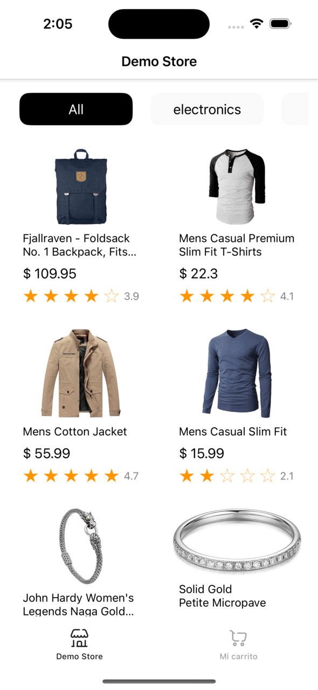
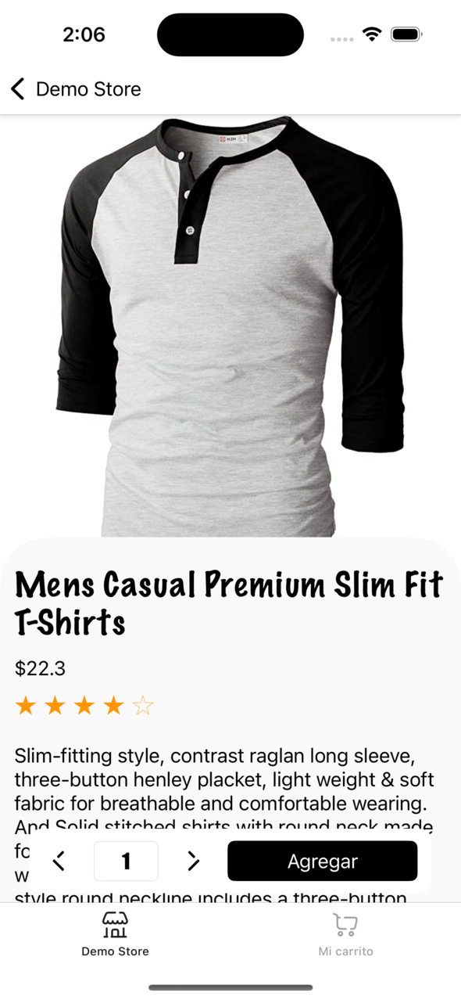
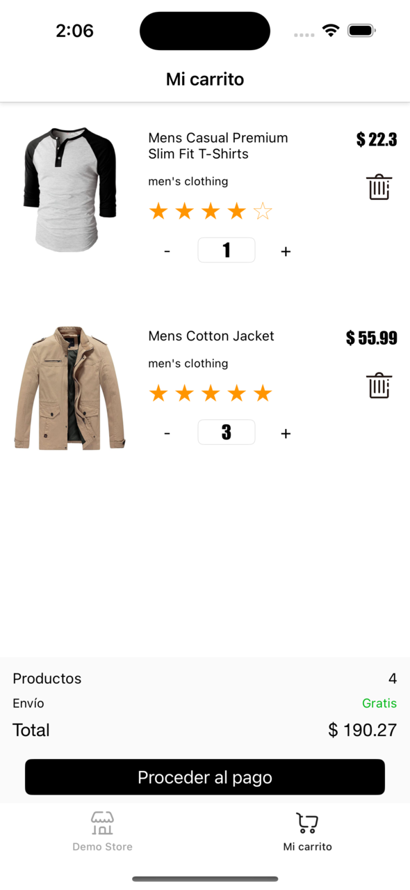

# Demo Store App

Una aplicación desarrollada en Swift que simula una tienda en línea utilizando la API pública **Fake Store API**. Permite explorar un listado de productos, filtrarlos por categoría, ver información detallada de cada producto y gestionar un carrito de compras con persistencia local.

## Características

- Listado completo de productos obtenidos desde la API.
- Filtro por categorías para facilitar la búsqueda de productos.
- Visualización detallada de cada producto, incluyendo:
  - Imagen del producto.
  - Nombre.
  - Descripción.
  - Precio.
  - Categoría.
- Carrito de compras con las siguientes funcionalidades:
  - Agregar productos.
  - Modificar cantidades.
  - Eliminar productos.
- Persistencia local del carrito utilizando **Core Data**.

**Nota:** Actualmente, la aplicación no cuenta con la funcionalidad de proceder al pago, pero está planeada para futuras actualizaciones.

## Tecnologías utilizadas

- **Lenguaje:** Swift
- **Arquitectura:** VIPER
- **Persistencia local:** Core Data
- **Consumo de API:** URLSession
- **Gestión de dependencias:** Swift Package Manager

## Capturas de Pantalla

### Pantalla Principal


### Detalle del Producto


### Carrito de Compras


## Instalación

1. Clona este repositorio:
   ```bash
   git clone https://github.com/tuusuario/MyStoreApp.git
   ```

2. Abre el proyecto en Xcode.

3. Configura las dependencias con Swift Package Manager si es necesario.

4. Ejecuta la aplicación en un dispositivo o simulador compatible.

## Uso

1. Abre la aplicación y explora la lista de productos disponibles.
2. Filtra los productos según la categoría de tu interés.
3. Selecciona un producto para ver su información detallada.
4. Agrega productos al carrito, modifica las cantidades o elimínalos según sea necesario.

## API utilizada

Esta aplicación consume los datos de la API pública **Fake Store API**:

- [Fake Store API](https://fakestoreapi.com)

## Estructura del Proyecto

La aplicación sigue una arquitectura modular para facilitar el mantenimiento y la escalabilidad:

- **UI (View):** Gestión de la interfaz de usuario.
- **ViewModel:** Lógica de negocio y manejo del estado de la UI.
- **Model:** Representación de los datos obtenidos de la API y del almacenamiento local.
- **Repositorio:** Gestión de datos desde la API y Core Data.

## Contribuciones

Las contribuciones son bienvenidas. Por favor, sigue estos pasos:

1. Haz un fork del repositorio.
2. Crea una rama para tus cambios:
   ```bash
   git checkout -b mi-nueva-funcionalidad
   ```
3. Realiza tus cambios y confirma los cambios:
   ```bash
   git commit -m "Añadida nueva funcionalidad"
   ```
4. Envía un pull request.

## Autor

Desarrollado por [Oscar Martínez](https://github.com/DMNOscar).

## Licencia

Este proyecto está bajo la Licencia MIT. Consulta el archivo [LICENSE](LICENSE) para más detalles.

